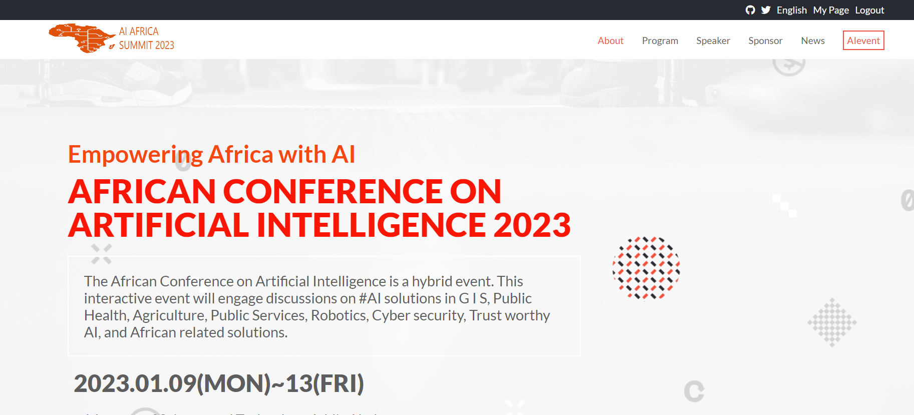
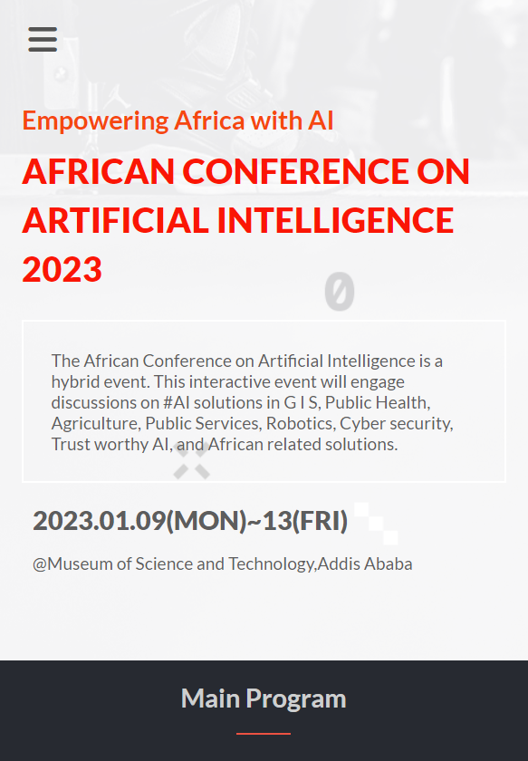

<!--
HOW TO USE:
This is an example of how you may give instructions on setting up your project locally.

Modify this file to match your project and remove sections that don't apply.

REQUIRED SECTIONS:
- Table of Contents
- About the Project
  - Built With
  - Live Demo
- Getting Started
- Authors
- Future Features
- Contributing
- Show your support
- Acknowledgements
- License

After you're finished please remove all the comments and instructions!
-->

  <h3><b>African Conference on AI 2023</b></h3>

<!-- TABLE OF CONTENTS -->

# 📗 Table of Contents

- [📖 About the Project](#about-project)
  - [:camera: project screenshot](#screen-shoot)
  - [:movie_camera: project video ](#loom-video)
  - [🛠 Built With](#built-with)
    - [Tech Stack](#tech-stack)
    - [Key Features](#key-features)
  - [🚀 Live Demo](#live-demo)
- [💻 Getting Started](#getting-started)
  - [Setup](#setup)
  - [Prerequisites](#prerequisites)
  - [Install](#install)
  - [Usage](#usage)
- [👥 Authors](#authors)
- [🔭 Future Features](#future-features)
- [🤝 Contributing](#contributing)
- [⭐️ Show your support](#support)
- [🙏 Acknowledgements](#acknowledgements)
- [📝 License](#license)

<!-- PROJECT DESCRIPTION -->

# 📖 Africa Conference on AI 2023 page 

> This conference page is part of the Microverse capstone project in portal module, which showed about the African artificial intelligence summit, which was held in Addis Abeba in January 2023. It was primarily built in pure HTML, CSS, and JavaScript, and it adhered to all best practices. as well as a mobile-first approach

## :camera: Project screenshots 

#### :computer: Desktop version

#### :iphone: Mobile version

 

## :movie_camera: Video link 

> To view a loom video, click the link below.

- [Live Demo Link](https://zewdu444.github.io/conference_page/index.html)

(<a href="#readme-top">back to top</a>)

## 🛠 Built With <a name="built-with">

HTML5, Pure CSS and Javascript in addition it used Cindy shin CC Global submit templete as guide line.</a>

### Tech Stack 

> HTML 5 , CSS flex box and CSS grid, javascript DOM and Javascript objecsts for dynamic loading contents.

<!-- Features -->

### Key Features 

>

- Mobile first approach
- CSS Flex box
- Interactive button
- CSS grid
- Javascript menu option
- Javascript DOM manipultion
- Objects and Array for data storage

(<a href="#readme-top">back to top</a>)
<!-- LIVE DEMO -->

## 🚀 Live Demo 

> To view a live demo, click the link below.

- [Live Demo Link](https://zewdu444.github.io/conference_page/index.html)

(<a href="#readme-top">back to top</a>)

<!-- GETTING STARTED -->

## 💻 Getting Started 

> To run on your localhost just copy the whole project and open index.html in your browser.

### Setup

> 
 git clonehttps://github.com/zewdu444/conference_page.git 

> cd conference_page

(<a href="#readme-top">back to top</a>)

### Prerequisites

In order to run this project you only need:

- latest web-browser

### Install

To install this project in your local machine use

> npm i

### Usage

To run the project, execute the following command:

> In visual studio code you can use Go live server or simply you can open index.html in browser

<!-- AUTHORS -->

## 👥 Authors 

👤 **zewdu erkyhun**

- GitHub: [@zewdu444](https://github.com/zewdu444)
- Twitter: [@zewdu444](https://twitter.com/zewdu444)
- LinkedIn: [zewdu-erkyhun](https://www.linkedin.com/in/zewdu-erkyhun-081378b3/)

<!-- FUTURE FEATURES -->

## 🔭 Future Features 

> News and AIevent page will be added

## 🤠Contributing 

Contributions, issues, and feature requests are welcome!

Feel free to check the [issues page](https://github.com/zewdu444/conference_page/issues).

(<a href="#readme-top">back to top</a>)

<!-- SUPPORT -->

## ⭐️ Show your support 

> If you like the project please give it star

(<a href="#readme-top">back to top</a>)

<!-- ACKNOWLEDGEMENTS -->

## 🙠Acknowledgments 

> I'd like to express my gratitude to the Microverse team.
> High regard for Cindy Shin's <a href="https://www.behance.net/gallery/29845175/CC-Global-Summit-2015">"CC Global Summit 2015"</a> templete.

(<a href="#readme-top">back to top</a>)

<!-- LICENSE -->

## 📠License 

This project is [MIT](./LICENSE) licensed.

(<a href="#readme-top">back to top</a>)

